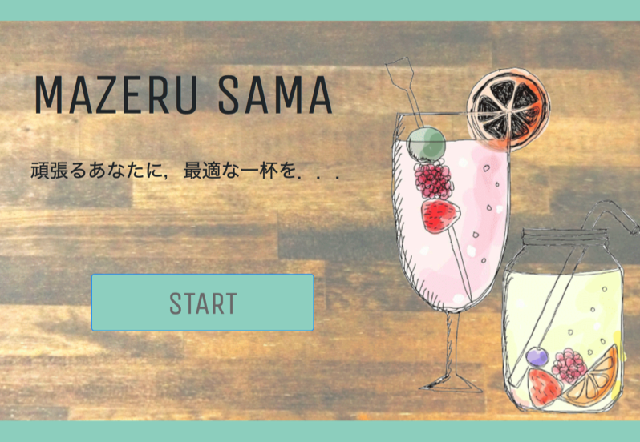

# MAZERU SAMA

## 製品概要
### 体力 ✕ Tech

### 背景（製品開発のきっかけ、課題等）
開発や研究で深夜まで作業をするときに，エナジードリンクに頼りがちな現状に気付きました．
疲れている中で更に頑張らないといけないときに，本当にエナジードリンクでいいのでしょうか・・・？
何かバイタルデータから，適切なドリンクを自動で調合してくれるようなシステムがあったらな，と思い本製品を開発しました．

### 製品説明（具体的な製品の説明）
本製品は，顔写真から感情を判断し，適切なドリンクを自動で作成するシステムです．

### 特長

#### 1. 特長1
顔の表情を撮影し，感情を判断
[Product Name](photo.png)
#### 2. 特長2
感情によって適切なドリンクを考案
[Product Name](result.png)
#### 3. 特長3
自動でドリンクを調合し，提供

### 解決出来ること
エナジードリンクに頼り過ぎる生活からおさらば！

### 今後の展望
顔以外のバイタルデータから，疲労度や体調を判断し，より適切なドリンクを提供
また，ドリンクの種類や，取得するデータを変えることで，パーティのような場でも活用

## 開発内容・開発技術
### 活用した技術
#### API・データ
* Google Cloud Vision AI

#### フレームワーク・ライブラリ・モジュール
* NodeJs
* Express

#### デバイス
* obniz
* 16ch PWM I2C-bus Controller

### 研究内容・事前開発プロダクト（任意）

### 独自開発技術（Hack Dayで開発したもの）

#### 2日間に開発した独自の機能・技術
* 感情分析の結果からドリンクを提案
* 
