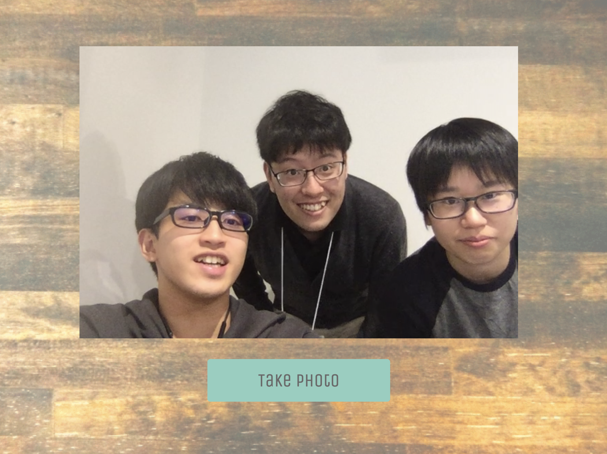
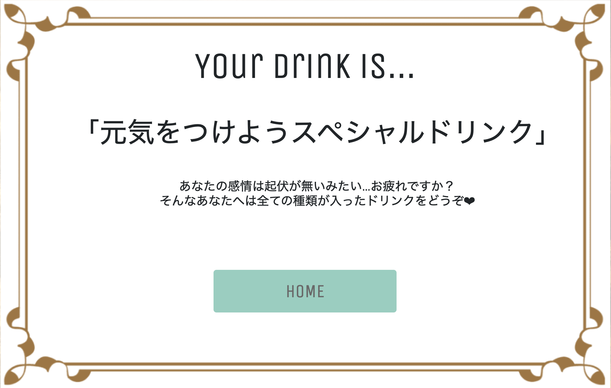

# MAZERU SAMA

## 製品概要
### 体力 ✕ Tech

### 背景（製品開発のきっかけ、課題等）
開発や研究で深夜まで作業をするときに，エナジードリンクに頼りがちな現状に気付きました．
疲れている中で更に頑張らないといけないときに，本当にエナジードリンクでいいのでしょうか・・・？
何かバイタルデータから，適切なドリンクを自動で調合してくれるようなシステムがあったらな，と思い本製品を開発しました．

### 製品説明（具体的な製品の説明）
本製品は，顔写真から感情を判断し，適切なドリンクを自動で作成するシステムです．
#### ターゲット
- エナジードリンクを沢山飲む人
- 色んなドリンクを楽しみたい人
- 新しい味や想定外の組み合わせに興味がある人
#### 概要
- あなたの為のオリジナルドリンクを調合するドリンクメーカー
- あなたの表情から感情を分析
- 感情に合った適切なドリンクを提供
- オリジナルドリンクで体力の限界を乗り越えろ！

### 特長

#### 1. 顔の表情を撮影し，感情を判断

#### 2. 感情分析を元にその人に適したドリンクを考案

#### 3. 自動でドリンクを調合し，提供

### 解決出来ること
エナジードリンクに頼り過ぎる生活からおさらば！

### 今後の展望
顔以外のバイタルデータから，疲労度や体調を判断し，より適切なドリンクを提供
また，ドリンクの種類や，取得するデータを変更することで，パーティのような場でも活用

## 開発内容・開発技術
### 活用した技術
* API
* デバイス開発
#### API・データ
* Google Cloud Vision AI

#### フレームワーク・ライブラリ・モジュール
* Node.js
* Express

#### デバイス
* obniz
* 16ch PWM I2C-bus Controller
* サーボモータ
* タブレット端末

### 独自開発技術（Hack Dayで開発したもの）
* 事前に行なったのはアイディア出しのみ！！

#### 2日間に開発した独自の機能・技術

* ドリンクメーカー，MAZERU SAMAのWebアプリの作成  
  * タブレットのカメラから顔写真を撮影し，感情分析
  * 感情分析の結果に基づいて，オリジナルドリンクを提案
* ドリンクメーカー，MAZERU SAMAの本体の作成
  * Webアプリが提案した，オリジナルドリンクを作成する機能
